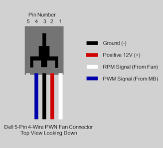
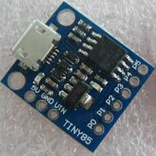
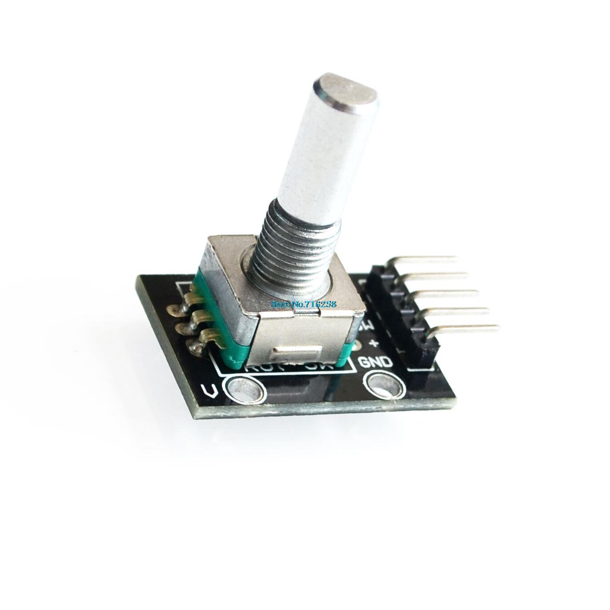
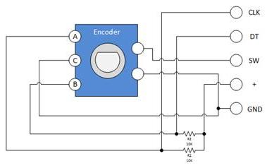
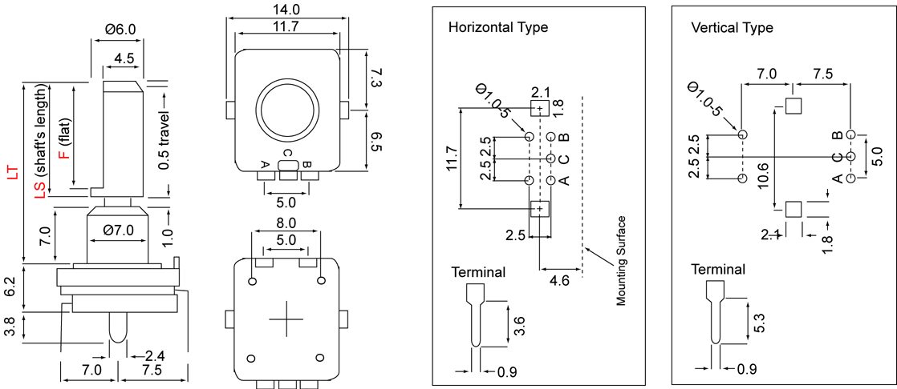
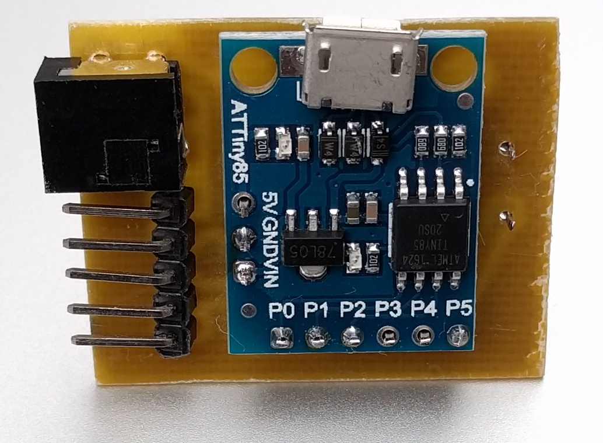
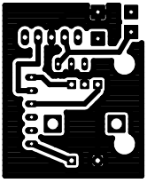
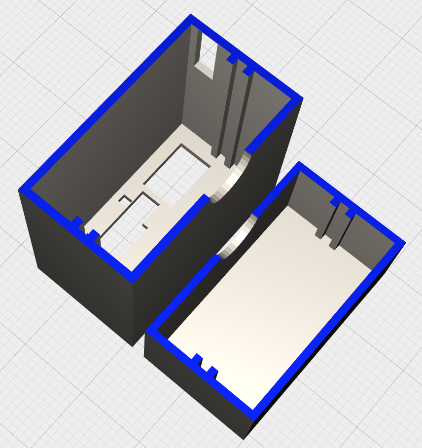
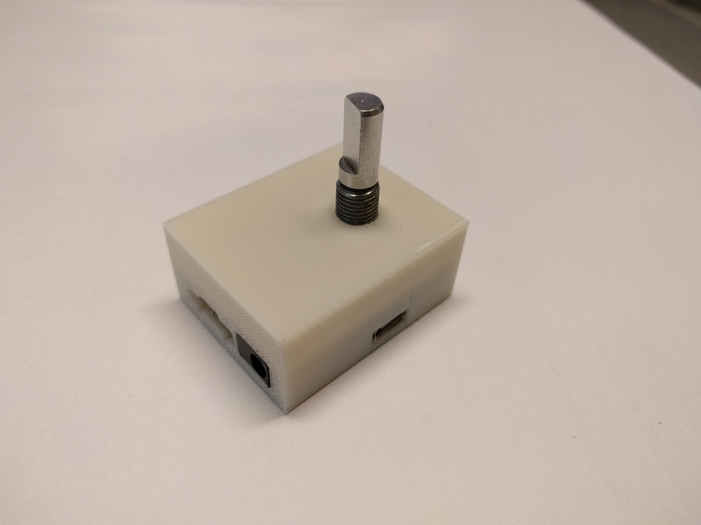

# fanspeed
pwm fan speed controller based on digispark-tiny85 and a quadrature encoder

I use a large PC fan to improve the ventilation around my 3d printer. It is 12V 1.3A and uses a 4 pin connector.

This is the project I used to learn to make my own PCBs and 3D printed cases.

## Firmware

The USB programmable Digispark takes some seconds to start. The fan spins up to fullsped then, and after that the encoder axis can be used to adjust speed. Left to do in the progam is to save the last used speed in EEPROM so that you don't have to tune the speed on each start.

## Components

The controller is a simple arduino with a atmel tiny85 processor.

A quadratur pulse encoder is used to adjust speed.

(for example https://www.ebay.com/p/3pcs-6mm-D-Shaft-18-Position-360-Degree-Rotary-Encoder-W-Push-Button-Ed/1749478696?_trksid=p2349526.c100534.m4207&_trkparms=aid%3D666006%26algo%3DPRP.MBE%26ao%3D1%26asc%3D20151029144032%26meid%3D657eb44e0d4b42509ba5e2342422b42b%26pid%3D100534%26rk%3D2%26rkt%3D4%26&rt=nc)

## power jack

I use a 1.3mm pin 3.5mm barrel connector. For example https://www.amazon.com/10Pcs-1-3x3-5mm-Female-Connector-Socket/dp/B00JR5HVA6.

## PCB

I use 0.4mm one sided PCB laminate.

The mounted PCB

Eagle Cad files are in board folder.

The PCB cad output

## Case

I use https://openjscad.org to create a 3d printable case.

### CAD model

### Live model (works in Chrome and Firefox)

https://openjscad.org/#https://raw.githubusercontent.com/dagrende/fanspeed/master/case/fanspeed-case.jscad

### 3D printed case

