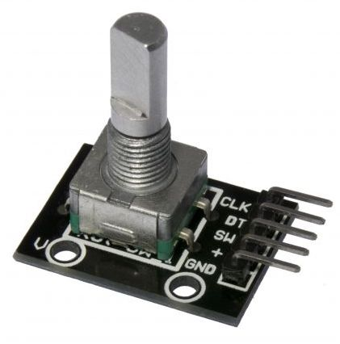

# fanspeed
pwm fan speed controller based on digispark-tiny85 and a quadrature encoder

I use a large PC fan to improve the ventilation around my 3d printer. It is 12V 1.3A and uses a 4 pin connector.

## Components

The controller is a simple arduino with a atmel tiny85 processor.

A quadratur pulse encoder is used to adjust speed.

## PCB

The mounted PCB

The PCB cad output

## Case

CAD model

3D printed case

